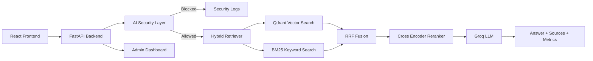

# Enterprise RAG

> **Secure Multi-Tenant Enterprise RAG** — a production-style AI knowledge assistant that answers questions over internal enterprise documents using advanced retrieval techniques, tenant-aware document isolation, hybrid search, cross-encoder reranking, an AI security layer, Google Drive integration, FastAPI, React, Docker, and CI.

---

# 🌐 Live Demo

- **Application:** https://enterprise-rag-574f275953cb.herokuapp.com/
- **API Docs:** https://enterprise-rag-574f275953cb.herokuapp.com/docs

---

# Overview

Enterprise RAG is an end-to-end AI knowledge assistant designed to demonstrate production-oriented AI engineering practices.

The system answers questions over internal enterprise documents while enforcing role-based document isolation using tenant-aware retrieval filters.

Unlike a basic RAG chatbot, this project combines:

- Semantic retrieval
- Keyword retrieval
- Hybrid search
- Cross-encoder reranking
- AI security scanning
- Observability
- Modern React interface
- Automated testing and deployment workflows

The application is deployed on Heroku with GitHub Actions CI for automated testing and golden dataset validation.

---

# Why Enterprise RAG?

Organizations store important knowledge across documents, PDFs, and internal systems. Traditional chatbots struggle because they often lack:

- Accurate document retrieval
- Permission-aware access
- Security controls
- Source transparency
- Evaluation workflows

This project explores how to build a secure AI assistant capable of retrieving enterprise knowledge while maintaining access boundaries.

---

# Features

## 🤖 AI Features

- Hybrid Retrieval (Vector Search + BM25 + Reciprocal Rank Fusion)
- Cross-Encoder reranking
- Sentence-Transformers embeddings
- Groq Llama models
- Source attribution
- Latency breakdown
- Token usage tracking
- Cost estimation per request

---

## 🔐 Security Features

- Multi-tenant document isolation
- Department and role filtering
- LLM-based prompt injection detection
- Jailbreak detection
- Cross-tenant access detection
- Privilege escalation detection
- Security event logging
- Runtime feature toggle

---

## ⚙️ Backend Features

- FastAPI backend
- Google Drive ingestion
- Structured API responses
- Health endpoint
- Manual synchronization endpoint
- Request tracing
- Global exception handling
- Configurable CORS
- Startup model preloading

---

## 🎨 Frontend Features

- React + TypeScript + Vite
- Tailwind CSS
- Zustand state management
- User chat interface
- Admin dashboard
- Dark mode
- Responsive design
- Source visualization
- Performance metrics display

---

## 🚀 DevOps Features

- Docker
- Docker Compose
- GitHub Actions CI
- Golden dataset validation
- Heroku deployment

---

# Architecture



---

# Retrieval Pipeline

The RAG pipeline works as follows:

1. Load enterprise documents
2. Extract document metadata
3. Split documents into chunks
4. Generate embeddings
5. Store embeddings and metadata in Qdrant Cloud
6. Retrieve documents using:
   - Vector similarity search
   - BM25 keyword search
7. Merge results using Reciprocal Rank Fusion (RRF)
8. Re-rank candidates using Cross Encoder
9. Generate final response using Groq LLM
10. Return:
    - Answer
    - Sources
    - Retrieval scores
    - Performance metrics

---

# AI Security Layer

Every user query passes through an LLM-based security scanner before reaching the retrieval pipeline.

The scanner detects:

- Prompt injection attempts
- Jailbreak attempts
- Cross-tenant access attempts
- Privilege escalation attempts
- System prompt extraction attempts

The scanner returns:

- Decision
- Category
- Reason
- Risk score

Unsafe requests are blocked before retrieval.

Blocked attempts are logged and displayed in the administrator dashboard.

The security layer can be enabled or disabled using:

```env
ENABLE_AI_SECURITY_LAYER=true
```

---

# Tech Stack

| Layer            | Technology                           |
| ---------------- | ------------------------------------ |
| Backend          | FastAPI (Python 3.12)                |
| Frontend         | React 18 + TypeScript + Vite         |
| Styling          | Tailwind CSS                         |
| Vector Database  | Qdrant Cloud                         |
| Embeddings       | all-MiniLM-L6-v2                     |
| Reranker         | cross-encoder/ms-marco-MiniLM-L-6-v2 |
| LLM              | Groq (Llama 3.3, Llama 3.1)          |
| State Management | Zustand                              |
| Testing          | Pytest, FastAPI TestClient           |
| CI               | GitHub Actions                       |
| Deployment       | Heroku                               |
| Containerization | Docker                               |

---

# Project Structure

```
backend/
  app/
    api/
    rag/
    security/
    services/
    models/
    scripts/

frontend/
  src/
    components/
    pages/
    store/
    api/
    types/

README.md
```

---

# API

## POST `/chat`

Returns:

- Generated answer
- Source documents
- Vector similarity score
- RRF score
- Reranker score
- Text previews
- Retrieval latency
- Reranking latency
- Generation latency
- Security scanner latency
- Token usage
- Request ID

---

## GET `/health`

Provides system health information used by monitoring and frontend status indicators.

---

## POST `/sync`

Manually synchronizes documents from Google Drive.

---

# Running Locally

## Backend

```bash
git clone <repo>

cd backend

uv sync

uv run uvicorn app.main:app --reload
```

---

## Frontend

```bash
cd frontend

npm install

npm run dev
```

---

# Environment Variables

```env
GROQ_API_KEY=

QDRANT_URL=
QDRANT_API_KEY=

GOOGLE_DRIVE_FOLDER_ID=

ENABLE_AI_SECURITY_LAYER=true

ALLOWED_ORIGINS=http://localhost:5173
```

---

# Testing

The project includes:

### Unit Tests

Testing:

- Document loaders
- Chunking
- Embeddings
- Vector store
- Retriever
- BM25
- Reranker

### Integration Tests

Testing:

- Google Drive connector
- API endpoints
- Multi-tenant isolation

### API Tests

Using:

- FastAPI TestClient

### Golden Dataset Validation

Validates retrieval and answer quality against predefined examples.

Run:

```bash
pytest
```

---

# CI Pipeline

GitHub Actions automatically performs:

1. Dependency installation
2. Automated tests
3. Golden dataset validation
4. Build verification

---

# Deployment

Current deployment:

- **Backend:** Heroku
- **Vector Database:** Qdrant Cloud
- **LLM Provider:** Groq

---

# Completed Features

## 1. Core RAG Engine

Implemented:

- Document loading from local files and Google Drive
- Configurable chunking strategy
- Sentence Transformer embeddings
- Qdrant vector storage
- Metadata filtering
- Hybrid retrieval
- BM25 keyword search
- Reciprocal Rank Fusion
- Cross Encoder reranking
- Groq LLM generation

---

## 2. Multi-Tenancy

Implemented:

- Metadata extraction from document paths
- Department isolation
- Role isolation
- Qdrant payload filtering
- Tenant-aware BM25 indexes

---

## 3. Google Drive Connector

Implemented:

- Service account authentication
- Recursive folder traversal
- Streaming document processing
- TXT support
- PDF support
- DOCX support
- Manual synchronization script

---

## 4. AI Security Layer

Implemented:

- LLM-based prompt scanner
- Risk classification
- Security logging
- Admin monitoring
- Runtime feature toggle

---

## 5. FastAPI Backend

Implemented:

- REST endpoints
- Pydantic schemas
- Request IDs
- Structured responses
- Exception handling
- CORS configuration
- Model preloading
- Token tracking

---

## 6. React Frontend

Implemented:

- Chat interface
- Admin dashboard
- Source cards
- Latency visualization
- Security event table
- Token usage table
- Dark mode
- Responsive layout
- Zustand state persistence

---

## 7. Observability

Implemented:

- Request tracing
- Latency measurement
- Token usage tracking
- Cost estimation
- Security event monitoring

---

## 8. Containerization

Implemented:

- Backend Dockerfile
- Frontend Dockerfile
- Docker Compose
- Health checks

---

# Future Improvements

| Priority | Feature                                |
| -------- | -------------------------------------- |
| 1        | Background workers for ingestion jobs  |
| 2        | Automatic Google Drive synchronization |
| 3        | Streaming LLM responses                |
| 4        | Authentication and user sessions       |
| 5        | Redis caching                          |
| 6        | Advanced evaluation metrics            |
| 7        | More enterprise connectors             |

---

# Engineering Decisions

## Why Hybrid Search?

Vector search provides semantic understanding but may miss exact technical terms.

BM25 improves retrieval for:

- API versions
- Error codes
- Product names
- Technical keywords

Reciprocal Rank Fusion combines both approaches to improve retrieval quality.

---

## Why Cross Encoder Reranking?

Initial retrieval focuses on recall by collecting possible relevant documents.

The Cross Encoder improves precision by deeply comparing the user query with retrieved candidates.

---

# License

MIT License

---

# Author

Built as a production-style AI Engineering portfolio project demonstrating:

- Secure Enterprise RAG
- Hybrid retrieval
- AI security
- Evaluation workflows
- Full-stack AI application development
- Cloud deployment
